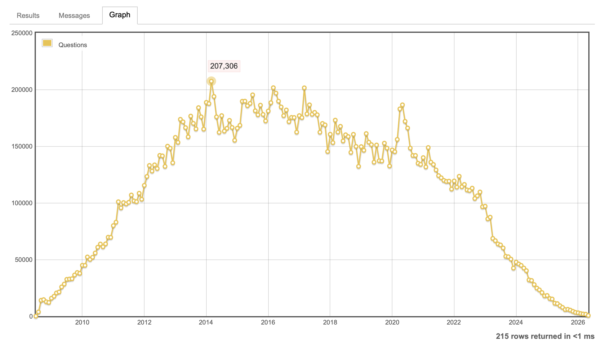

# История Ask Jeeves - поисковой системы, опередившей время


В 1996 году интернет был еще очень молод, а поиск информации в нем
представлял собой довольно сложную задачу.
Именно в те далекие годы на сцене появился интеллигентный дворецкий,
готовый помочь найти ответ на любой вопрос.
Так начиналась история Ask Jeeves - сервиса, который опередил
свое время на десятилетия. Но 1 мая 2026 года этот первопроходец,
переживший взлет и падение доткомов, прекратил свое существование.
Почему же проект, предложивший идеи, которые сегодня реализуют
ChatGPT и Perplexity, не смог выжить?
Давайте разберемся в истории взлета и падения поисковой системы,
которая была "прадедушкой" современных чат-ботов.

### Рождение джентльмена: от идеи к феномену

В 1996 году в Беркли, штат Калифорния, Гарретт Грюнер и Дэвид Уортон
основали компанию, которой суждено было стать пионером в области поиска.
Их творение получило имя Ask Jeeves (Спроси Дживса),
а его маскотом стал персонаж книг П.Г. Вудхауза - находчивый
камердинер Реджинальд Дживс.

Главная "фишка" сервиса была революционной: в отличие от других
поисковиков, которые работали только с ключевыми словами,
Ask Jeeves позволял задавать вопросы на естественном, разговорном языке.
Пользователь мог написать: *«Какая столица Франции?»* вместо того,
чтобы ломать голову над набором ключевых слов вроде *«столица Франция»*.
Удобство и человеческое лицо сервиса быстро принесли ему популярность:
уже через два года он обрабатывал более миллиона запросов в день,
став одним из самых посещаемых сайтов конца 1990-х.

### Смена владельца и потеря лица

В 2005 году на пике популярности Ask Jeeves привлек внимание
медиамагната Барри Диллера. Его компания IAC/InterActiveCorp приобрела
поисковик за $1.9 миллиарда, планируя создать конкурента Google.
Однако новые владельцы, стремясь модернизировать сервис,
начали с радикальных перемен: в 2006 году они провели ребрендинг,
превратив Ask Jeeves в безликий Ask.com и уволив его
главное украшение - дворецкого Дживса.
Сам Диллер назвал персонажа "чемоданом без ручки",
который мешает сервису конкурировать в серьезном мире поиска.

Это решение стало роковым. Лишившись индивидуальности,
Ask.com начал стремительно терять аудиторию,
так и не сумев навязать реальную конкуренцию Google.
И хотя в 2009 году Дживса попытались ненадолго вернуть на рынок
Великобритании, былой магии это уже не вернуло.
К 2010 году Барри Диллер публично признал поражение, заявив,
что Ask.com не в силах конкурировать с поисковым гигантом.

## Как работал Ask Jeeves: симбиоз человека и машины

### Армия редакторов: за кулисами "дворецкого"

Секрет "интеллекта" Дживса был прост и сложен одновременно.
За способностью понимать живую речь стояла не столько мощная технология,
сколько труд целой армии людей.

Основой Ask Jeeves была гигантская база данных,
вручную заполняемая редакторами и модераторами.
Их задача заключалась в том, чтобы предугадывать вопросы
пользователей и готовить на них эталонные ответы.
Например, в британском подразделении компании работали 15 редакторов,
которые ежедневно прочесывали интернет в поисках лучших источников
для ответов на самые популярные вопросы.
Именно этот ручной труд и создавал иллюзию,
что виртуальный дворецкий Дживс действительно вас понимает.

Процесс сочетал в себе человеческую экспертизу и технологии:
редакторы вручную отбирали лучшие сайты,
а автоматические алгоритмы использовали эти оценки
для ранжирования результатов. Таким образом,
Ask Jeeves был не просто поисковиком, а, скорее, предшественником
современных систем вроде Retrieval-Augmented Generation (RAG),
где ответ генерируется на основе проверенной базы знаний.

### NLP в 90-х: шаблоны вместо нейросетей

Технологическая начинка Ask Jeeves была, по современным меркам,
очень простой. Она основывалась на системе вопросно-ответных шаблонов.
Когда пользователь вводил свой вопрос, система пыталась сопоставить
его с одним из заранее заготовленных шаблонов.

Исходный код Ask Jeeves закрыт, и мы не знаем точно,
как были реализованы его алгоритмы, но мы можем предположить,
как это работало. Это был не семантический анализ,
а скорее грамматический разбор запроса с использованием шаблонов.
Например, система могла использовать подобную логику:

```python
import re

def match_query(user_query):
    templates = [
        (r"[Кк]акая столица (у )?(?P<country>[А-Яа-я ]+)\??",
         "Столица страны {country} - ..."),
        (r"[Кк]то такой (ая )?(?P<person>[А-Яа-я ]+)\??",
         "{person} - это ..."),
        (r"[Сс]колько лет (?P<person>[А-Яа-я ]+)\??",
         "Возраст {person}: ... лет."),
    ]

    for pattern, answer_template in templates:
        match = re.match(pattern, user_query)
        if match:
            return answer_template.format(**match.groupdict())

    return "Пожалуйста, переформулируйте ваш вопрос."

print(match_query("Какая столица Франции?"))
# Вывод: Столица страны Франция - ...
```

## Конкуренция с Google: как количество побеждает качество

### Битва подходов: ручной труд против бездушного алгоритма

Ask Jeeves сделал ставку на качество и точность ответов.
Google, появившийся двумя годами позже, в 1998 году,
пошел принципиально другим путем - он сделал ставку на brute-force:
мощные алгоритмы индексации и анализа ссылочной массы.
В отличие от трудоемкой работы редакторов Ask Jeeves,
алгоритм PageRank от Google мог обрабатывать миллиарды страниц
автоматически, без участия человека.

И здесь мы видим интересную параллель с современным развитием
нейросетей. Ранние языковые модели часто критиковали за бессвязность и
неточность, но по мере увеличения их размера и объема данных
для обучения качество ответов росло экспоненциально.
Google в конце 90-х и начале 2000-х продемонстрировал тот же принцип:
количество проиндексированных страниц и данных о поведении
пользователей в какой-то момент перешло в качество поиска.
Грубая алгоритмическая сила победила трудоемкую ручную работу.

Результаты этого противостояния оказались убийственными для Ask Jeeves.
В 2009 году доля Ask на поисковом рынке США составляла жалкие 3.9%,
в то время как Google контролировал уже 65%.
Спустя годы разрыв стал тотальным, и Google занял более 90% рынка.

### Проблема масштаба: почему Ask не мог расти

Главная проблема Ask Jeeves стала очевидна именно в контексте
глобальной конкуренции. Модель Google была практически бесконечно
масштабируемой: один и тот же алгоритм мог обслуживать запросы
миллиардов пользователей по всему миру, требуя лишь наращивания
серверных мощностей. Модель Ask Jeeves требовала прямо
противоположного - для обработки запросов на новом языке нужно
было нанимать носителей этого языка и создавать новую редакцию.

Компания действительно пыталась выходить на международные рынки:
Ask Jeeves запускал версии в Испании, Нидерландах и других странах,
для которых требовалось создание отдельных баз знаний и шаблонов.
Но поддерживать такую армию редакторов по всему миру было
астрономически дорого. Если у вас есть деньги на содержание штата
из тысяч редакторов по всему миру, то, как гласит старая
шутка предпринимателей, вам уже не нужен никакой бизнес.

К 2010 году, когда Google стал безоговорочным лидером,
а конкурировать с ним было уже невозможно,
IAC принял решение отказаться от собственной поисковой технологии и
передал ее на аутсорсинг, окончательно признав поражение в гонке
поисковых систем.

## Всему свое время: почему отличная идея не гарантирует успех

История Ask Jeeves - это хрестоматийный пример того,
что даже самая прорывная идея обречена, если она появилась
на неподготовленной почве. Технология, которую предложил
Ask Jeeves в 1996 году, была гениальна, но для ее полноценной
реализации не было главного - достаточно мощного и дешевого
искусственного интеллекта.

В те времена, 30 лет назад, человечество еще только привыкало
к интернету и персональным компьютерам.
Идея общения с машиной на естественном языке казалась чудом,
но поддерживать эту иллюзию можно было только с помощью тысяч редакторов.
Точно так же, как идеи глубокого обучения и нейронных сетей
десятилетиями лежали на полках академических лабораторий,
дожидаясь своего часа и появления мощных видеокарт,
Ask Jeeves ждал появления ChatGPT.

Современные большие языковые модели (LLM) по сути реализовали
ту же идею, что и Ask Jeeves, но на качественно новом уровне.
Теперь не нужно писать шаблоны и нанимать редакторов - нейросеть
сама «понимает» запрос и генерирует ответ. Революция,
которую совершил ChatGPT в конце 2022 года, была бы немыслима в 1996-м.
Пользователи, технологии и, что немаловажно, бизнес-модели оказались
готовы к этому только сейчас.

## Кто следующая жертва?

Закрытие Ask.com - не единичный случай, а часть глобального тренда.
Нейросети сегодня выполняют те же самые действия,
что и специализированные сервисы, но если они делают это
значительно быстрее и качественнее, то ставят под вопрос
само существование этих сервисов.

### Stack Overflow
Легендарный сайт вопросов и ответов для программистов
столкнулся с катастрофическим падением трафика.
На момента запуска ChatGPT (на графике между 2022 и 2024)
количество новых вопросов на платформе было ~110 000
в месяц. Сейчас же (май 2026) их число сократилось  <2000 в месяц,
т.е. разница более чем в 55 раз!
Теперь разработчику проще задать вопрос нейросети и
сразу получить персонализированный ответ с примерами кода,
чем искать подходящую ветку на форуме. Сам Stack Overflow и так
переживал не лучшие времена, так как после пика популярности в 2014
началось очень медленное снижение активности. На мой взгляд вопросов
и ответов уже тогда было так много, что новые оригинальные вопросы,
на которые легко можно было ответить на форуме



*   **Онлайн-переводчики:** Хотя гиганты вроде Google Translate держатся,
нишевые сервисы и бюро переводов, которые выполняли простые заказы,
становятся не нужны. Нейросети вроде DeepL и GPT-4 выполняют
перевод на совершенно другом уровне, учитывая контекст и стилистику,
что убивает рынок дешевого переводческого труда.
*   **Почта России и традиционная логистика:** Это пример другого рода.
"Почта России" была абсолютным монополистом и первопроходцем в доставке,
но полностью проиграла конкурентную борьбу более
технологичным и клиентоориентированным сервисам. Сегодня
же и эти сервисы находятся под угрозой: нейросети оптимизируют
логистику и маршруты так, как не снилось традиционным компаниям,
а ИИ-ассистенты в разы повышают качество клиентского сервиса.

Во всех этих случаях повторяется один и тот же паттерн:
появляется нейросеть, которая выполняет ключевую функцию
старого сервиса (отвечает на вопросы, переводит, пишет код),
но делает это быстрее и качественнее.
Ask.com был пионером этого подхода, но его трагическая ирония в том,
что он не дожил до того момента, когда технологии наконец
смогли воплотить его идеи в жизнь.

## Дух Дживса жив

В своем прощальном сообщении команда Ask.com написала:
*"Дух Дживса жив"*. И это действительно так, но не в том смысле,
что мы помним старый бренд. Дух Дживса реинкарнировался
в каждом современном сервисе, который сегодня разговаривает
с нами на естественном языке.

ChatGPT, Perplexity, Bing AI, Google SGE -
все они реализуют ту самую идею, которую Ask Jeeves предложил миру
в 1996 году. Они задают вопросы, дают ответы и делают взаимодействие
с технологиями человечнее.
Ask Jeeves был слишком рано, но он указал путь, по которому
мы идем до сих пор. И хотя сам сервис закрылся,
его главная идея - сделать поиск естественным и понятным - сегодня
торжествует как никогда. Прощай, Дживс, и спасибо за то,
что показал нам будущее.