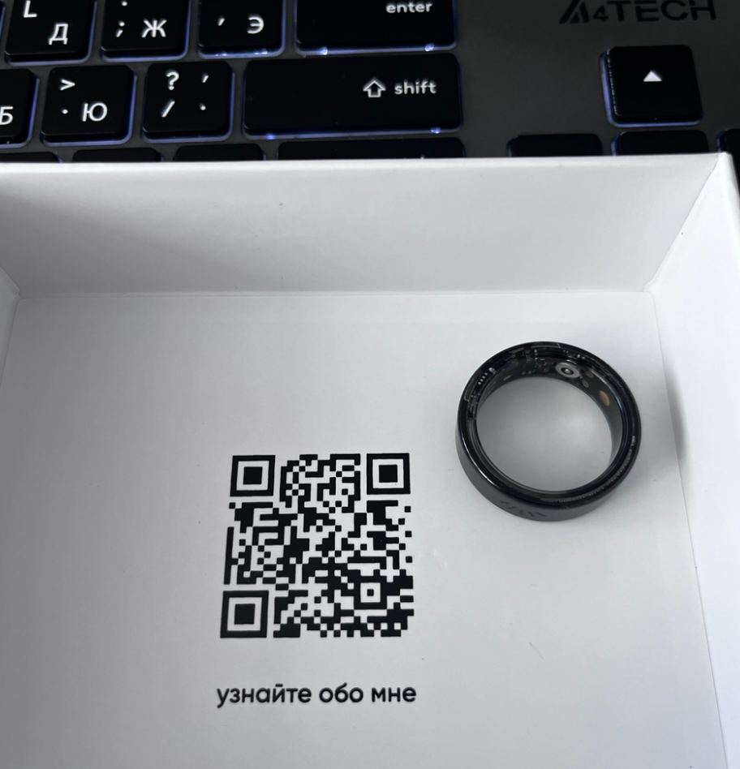
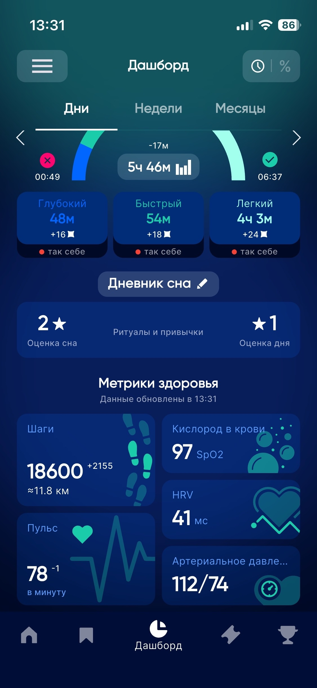
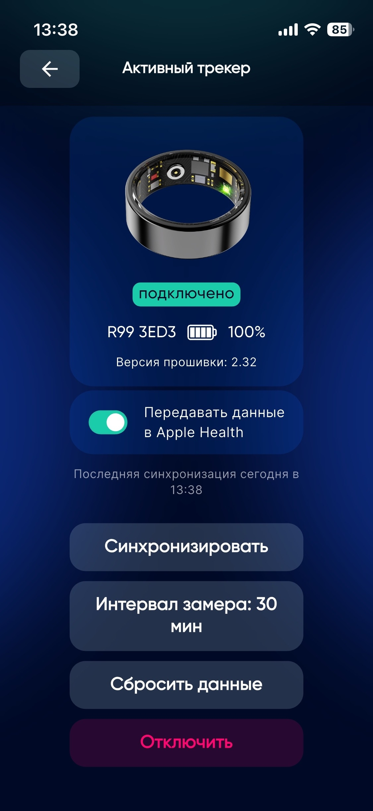
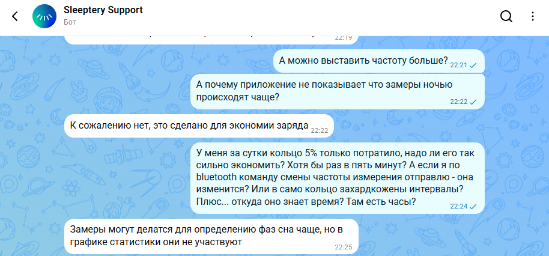

# Sleepring и Wolfram

Несколько дней назад я купил умное кольцо Sleepring.
Я наткнулся на него после прочтения вот этой [статьи](https://habr.com/ru/articles/1001628/).
Там было перечислено 5 умных колец. Именно это я выбрал, так как оно позиционируется,
как кольцо для мониторинга сна - это как раз то, что нужно для моего здоровья.
Я в общих чертах представляю как такие кольца работают и что их измерения имеют большую погрешность.
Но результаты с погрешностью все равно лучше, чем отсутствие результатов.
Не буду долго описывать как я читал отзывы, заказывал и примерял кольцо.
В статье будет пошагвое описание процесса "реверс-инжинеринга" от дилетанта в этой области.

## Начало использования и частота автоматических замеров

Итак, я открыл коробочку с кольцом, на крышке был QR-код.
В QR-коде ссылка, которая ведет на [страничку с информацией](https://sleeptery.ru/sleepring/welcome).
Там же я нашел ссылку на скачивание приложения для iOS.
Вот кстати само кольцо, крышка от коробочки и моя клавиатура

Я установил приложени, запустил его и подключился к кольцу по инструкции.
После непродолжтельного исследования было обнаружено, что приложение автоматически измеряет
шаги, пульс, давление, уровень кислорода и HRV (в описании сказано, что это связано с периодом сердцебиения).

НО! Затем я залез в раздел с настройками и увидел, что в ручную можно
установить период замеров только 30, 40, 50 и 60 минут!
Я сразу подумал, что замеры раз в 30 минут - слишком редко.

Поэтому в ту же минуту отправился в чат с поддержкой чтобы выяснить,
как можно сделать частоту замеров выше.
Увы, поддержка ответила мне, что такой функции нет, а минимальный период 30 минут
нужен для экономии заряда. Вот кстати ответ поддержки:

